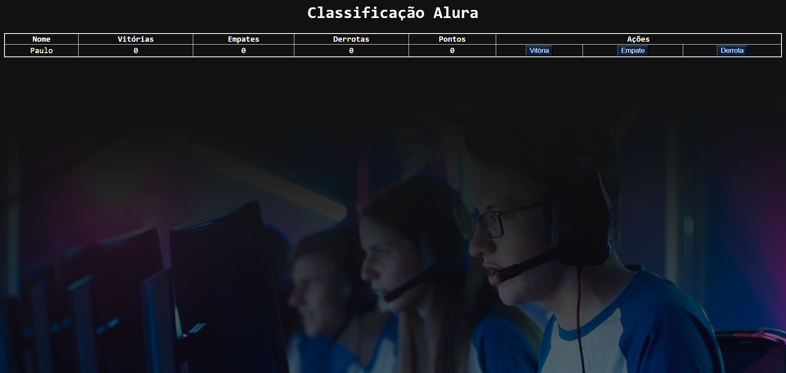

<h1 align="center"> Projeto Imersão Alura Dev</h1>

Imersão em Desenvolvimento Web - Javascript

---

 

  

---

  

---

  

---
## 💻 Tecnologias

Esse projeto foi desenvolvido com as seguintes tecnologias:

- HTML5
- CSS3
- Javascript 
- Git e Github

---

## 🚧 Projeto

<strong>Aula 1</strong>
 
AluraFlix
 
Utilizaremos o input para permitir a entrada de dados diretamente na tela, evitando a necessidade de inserir informações diretamente no código ou no console. Abordando os seguintes tópicos: 
- Sintaxe e criação de funções no JavaScript;
- Integração de funções criadas no JavaScript com o HTML exibido na tela;
- Condicionamento da execução (ou "chamada") de uma função a um clique em um botão na tela;
- Uso do JavaScript para acessar o que está sendo exibido na tela e obter valores digitados pelo usuário com getElementById() e .value;
- Passagem de informações necessárias para o funcionamento das funções por meio de parâmetros;
- Utilização do .endsWith() para verificar se um texto termina com determinados caracteres;
- Demonstração de um exemplo adicional de reatribuição de variável para "limpar" o texto do campo com ""

 

<strong>Aula 2</strong>
 
Jogo de adivinhação
 
Neste desafio, o programa escolherá um número aleatório, e nosso objetivo é adivinhar esse número. 
Abordando os seguintes tópicos:
- Realizar o fork do projeto com o template inicial;
- Realizar testes interativos usando prompt;
- Criar a lógica do jogo utilizando estruturas condicionais como if e else;
- Utilizar a função Math.random() do JavaScript para gerar números aleatórios.
- Função: var numeroSecreto = parseInt(Math.random() * 1001)

 

<strong>Aula 3</strong>
 
Estruturas de dados e como trabalhar com listas. Abordando os seguintes tópicos:
- Criação de uma primeira array de filmes usando a sintaxe [];
- Uso do método filmes.push("Nome Do Filme") para inserir um novo elemento na lista (ou seja, um novo filme na array);
- Descoberta da quantidade de elementos em uma array com o método array.length;
- Seleção de elementos de uma array utilizando a sintaxe array[número], lembrando que o primeiro índice começa com zero, ou seja, array[0] para o primeiro elemento;
- Utilização da instrução for para iterar, ou seja, percorrer todos os elementos de uma array;
- Criação de uma array com imagens de pôsteres de alguns filmes que gostamos;
- Montagem da lógica do programa que irá iterar está array de filmes e exibir cada um deles na tela, integrando o for do JavaScript com document.write()

 

<strong>Aula 4</strong>
 
AluraFlix
 
Utilizando o input para permitir a entrada de dados diretamente na tela, evitando a necessidade de inserir informações diretamente no código ou no console. Será abordado os seguintes tópicos:
- Sintaxe e criação de funções no JavaScript;
- Integração de funções criadas no JavaScript com o HTML exibido na tela;
- Condicionamento da execução (ou "chamada") de uma função a um clique em um botão na tela;
- Uso do JavaScript para acessar o que está sendo exibido na tela e obter valores digitados pelo usuário com getElementById() e .value;
- Passagem de informações necessárias para o funcionamento das funções por meio de parâmetros;
- Utilização do .endsWith() para verificar se um texto termina com determinados caracteres;
- Demonstração de um exemplo adicional de reatribuição de variável para "limpar" o texto do campo com ""

 

<strong>Aula 5</strong>
 
Tabela de Classificação. Será abordado os seguintes tópicos:
 
- Remover o código estático do HTML;
- Criar um objeto no JavaScript para cada jogador;
- Criar uma função que receba um objeto como parâmetro para calcular os pontos;
- Exibir o objeto na página HTML;
- Criar uma função para adicionar vitórias, outra para adicionar empates e uma última para adicionar derrotas
  
 

Você pode ver o Projeto Principal neste link: [Imersão Alura Dev](https://nigerade.github.io/Alura-Imersao/)

 

#imersãodev 
#alura

--- 